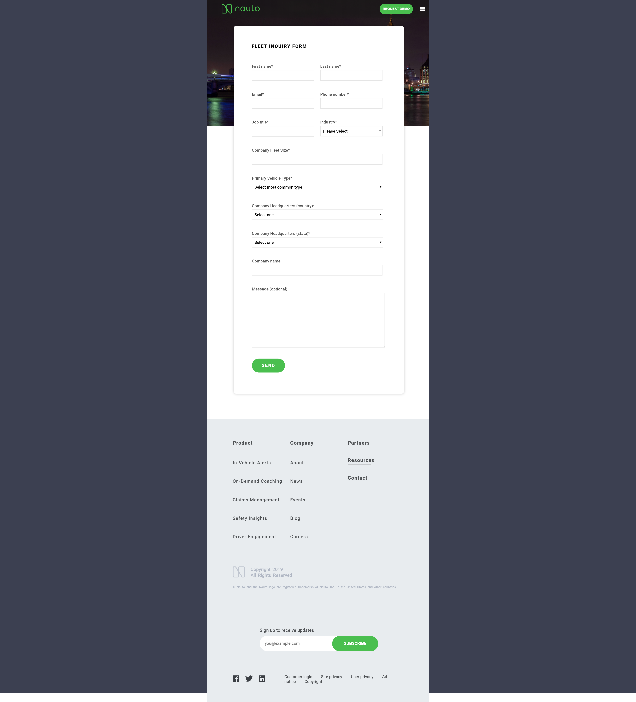

# CSS and HTML Landing Page 

This is a clone of the [Nauto](https://www.nauto.com/contact) contact page. Was made using only CSS and HTML.

This clone page is fully responsive.

## Specific Skills
* HTML5
* CSS3
* CSS Grid Layout
* BEM Methodology

## Demo

You can check the result [here!](https://juancaricodev.github.io/landing-page/)

### Responsive Page Preview

